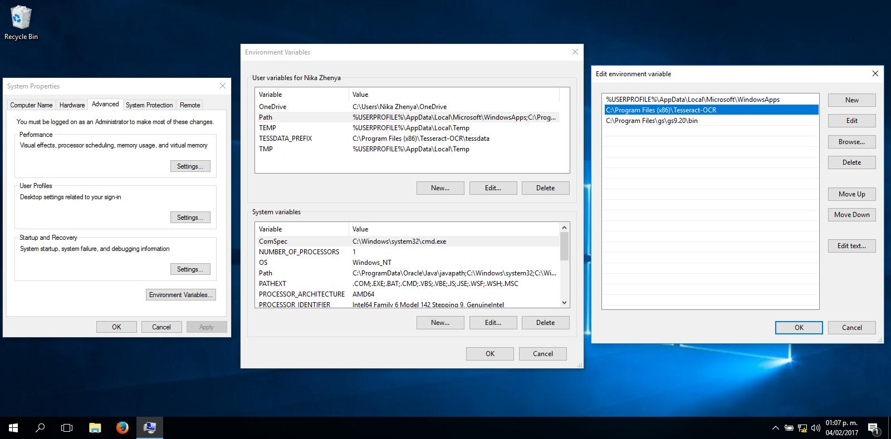

# Tegs

Tegs utiliza el poder de Tesseract y de Ghostscript para crear archivos PDF con OCR o TXT a partir de imágenes TIFF, PNG o BMP.

## Requerimientos

* [Tesseract](https://github.com/tesseract-ocr/tesseract)
* [Ghostscript](https://www.ghostscript.com/)

## Uso

  ```
  pt-tegs -d [directorio] -l [idioma] -o [nombre del archivo]
  ```

## Descripción de los parámetros

### Parámetros necesarios

* `-d` = [directory] Directorio que contiene las imágenes.
* `-l` = [language] Acrónimo del lenguaje a detectar. Es necesario instalar el lenguaje. [Lista de acrónimos](https://github.com/tesseract-ocr/tesseract/blob/master/doc/tesseract.1.asc#languages).
* `-o` = [output] Nombre para el o los archivos que se crearán.

### Parámetros opcionales

* `-t` = [text] Crea un TXT adicional al PDF creado.
* `-c` = [compressed] Crea un PDF comprimido adcional al PDF creado.

### Parámetros únicos

* `-v` = [version] Muestra la versión.
* `-h` = [help] Muestra la ayuda, la cual es este contenido.
* `-32` = [32 bits] SOLO WINDOWS, indica si la computadora es de 32 bits.

## Ejemplos

### Ejemplo sencillo

```
  pt-tegs -d directorio/de/las/imágenes -l spa -o prueba
```

Crea un archivo PDF con OCR en español y sin compresión a partir de las imágenes presentes en «directorio/de/las/imágenes».

### Ejemplo con PDF comprimido

```
  pt-tegs -d directorio/de/las/imágenes -l spa -o prueba -c
```

Además del PDF con OCR, se crea otro PDF con compresión.

### Ejemplo con archivo de texto

```
  pt-tegs -d directorio/de/las/imágenes -l spa -o prueba -t
```

Además del PDF con OCR, se crea un archivo de texto con el contenido de las imágenes.

### Ejemplo con PDF comprimido y archivo de texto

```
  pt-tegs -d directorio/de/las/imágenes -l spa -o prueba -c -t
```
  
Además del PDF con OCR, se crea otro PDF con compresión y un archivo de texto.

## Notas sobre Windows

Para que el *script* funcione correctamente en Windows, es necesario agregar
Tesseract y Ghostscript al path, así como agregar la variable `TESSDATA_PREFIX`.

[Aquí está un tutorial para poder hacerlo](http://www.computerhope.com/issues/ch000549.htm).
La configuración queda como se muestra a continuación.

> Path configurado:

> 

> `TESSDATA_PREFIX` agregado:

> 
