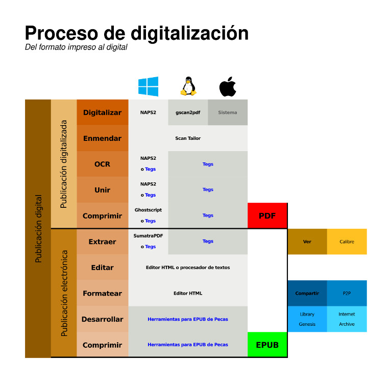

# *Scripts* para la digitalización de documentos

Aquí están presentes una serie de *scripts* pensados para agilizar o
automatizar la digitalización de documentos para obtener desde un PDF
hasta un EPUB. Estos son:

1. `tegs.rb`. Utiliza el poder de Tesseract y de Ghostscript para crear 
archivos PDF con OCR o TXT a partir de imágenes TIFF, PNG o BMP.

**Nota**: para la creación de EPUB, se utilizan las herramientas
presentes en la carpeta [`EPUB`](https://github.com/ColectivoPerroTriste/Herramientas/tree/master/EPUB) 
de este repositorio.
