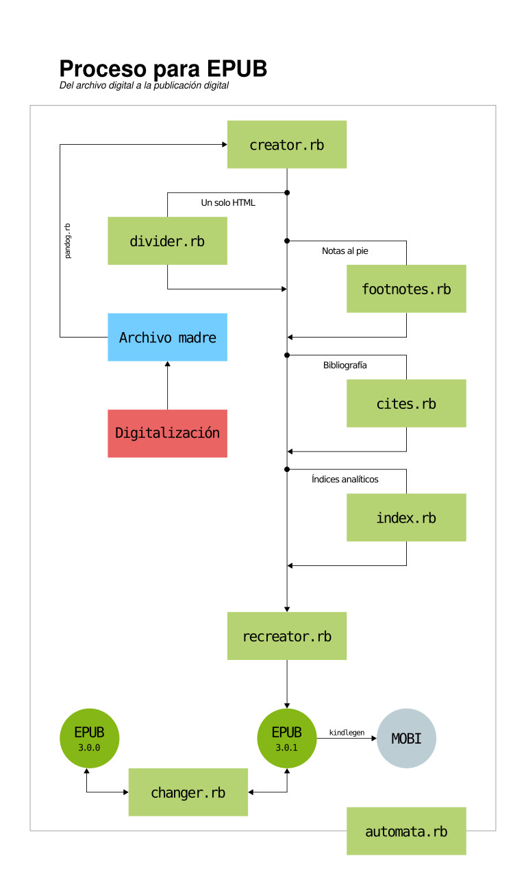

# *Scripts* para el desarrollo de EPUB

## EPUB con diseño fluido o fijo

Aquí están presentes una serie de *scripts*
pensados para agilizar o automatizar el desarrollo
de libros EPUB. Estos son:

1. `creator.rb`. Crea la estructura del EPUB, con
la posibilidad de incluir una hoja de estilos CSS
predeterminada.

2. `divider.rb`. Divide un solo documento HTML o
XHTML en varios documentos XHTML cada vez que
detecta encabezados `h1`. Principalmente está
pensado como un proceso más dentro de la
metodología del *single source publishing*.

3. `footnotes.rb`. Agrega de manera automatizada
las notas al pie a un libro EPUB o documentos
TeX.

4. `cites.rb`. Agrega de manera automatizada la
bibliografía en formato `.bib`
([BibTeX](http://www.bibtex.org/)) a un libro
EPUB.

5. `recreator.rb`. Recrea los archivos OPF, NCX y
NAV así como crea o recrea el archivo EPUB.

6. `changer.rb`. Cambia versiones de EPUB entre
`3.0.0` y `3.0.1`.

7. `index.rb`. Agrega índices analíticos.

## *Scripts* de JavaScript para EPUB

Estos *scripts* implementan algunas funcionalidades
adicionales a los EPUB, se encuentran en la carpeta
[`JavaScript`](https://github.com/ColectivoPerroTriste/Herramientas/tree/master/EPUB/JavaScript).

## EpubCheck

[EpubCheck](https://github.com/IDPF/epubcheck) es la herramienta de 
validación de EPUB de [IDPF](http://idpf.org/).

Esta carpeta contiene las versiones 3.0.1 y 4.0.0 de EpubCheck que 
pueden descargar desde su repositorio. La ventaja de esta carpeta es
que existe un binario para poder utilizar epubcheck de manera más 
sencilla.
