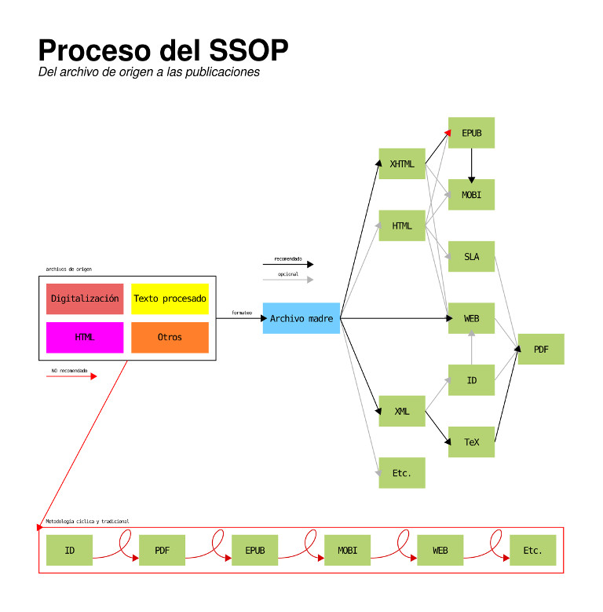

# Pecas: herramientas editoriales

Pecas es un conjunto de *scripts* pensados para agilizar
o automatizar varios de los procesos del quehacer editorial con el fin
de que las posibilidades tecnológicas no se presenten como un reto o un
inconveniente para quien edita o diseña una publicación.

Las herramientas siguen un modelo de [desarrollo continuo](https://es.wikipedia.org/wiki/Liberaci%C3%B3n_continua)
según el modelo del *single source and online publishing*.

## Índice

* [SSOP](#single-source-and-online-publishing-ssop)
* [Requisitos](#requisitos)
* [Instalación](#instalación)
* [Utilización](#utilización)
* [Pendientes](#pendientes)
* [¿Pecas?](#pecas)
* [Cursitos](#cursitos)
* [Licencia](#licencia)

---

# *Single source and online publishing* (SSOP)

Esta metodología de trabajo implica la idea de que a partir de un archivo
madre en marcado ligero sea posible crear de manera ramificada distintas 
salidas según el formato de la publicación deseada.

El archivo madre se diferencia del archivo de origen en que, aún siendo
ambos digitales, el primero ya ha sido tratado para ajustarse a las posibilidades 
y lineamientos de la metodología del SSOP.

El modelo ramificado de publicación se diferencia del modelo cíclico, común
en la tradición editorial, en que no es necesario esperar a que un formato
se dé por concluido con el fin de empezar la creación de otro.

Las ventajas de esta metodología son:

1. un mayor control semántico y estructural del contenido,
2. el fin al dilema donde «el tiempo de publicación es proporcional a la 
cantidad de formatos deseados»,
3. la practicidad de prescindir de la creación de respaldos por el control
de versiones del repositorio de la publicación,
4. la ventaja de actualizar la obra continuamente y sin dificultades,
5. la posibilidad de agregar excepciones según cada formato de salida, y
6. el fin a la transmisión de errores entre formatos que acontece al pasar
de un formato de salida a otro.

# Requisitos

## Todos

* [Ruby](https://www.ruby-lang.org/es/) >= 2.4
  
## Digitalización

* [Tesseract](https://github.com/tesseract-ocr/tesseract)
* [Ghostscript](https://www.ghostscript.com/)
* [Scan Tailor](http://scantailor.org/) (opcional)

## Archivo Madre

* [Pandoc](http://pandoc.org/) >= 2

# Instalación

**Solo para sistemas UNIX (Linux y Mac OS X).**

Los binarios permiten acceder a las herramientas desde la terminal sin necesidad
de indicar la ruta del `script` ni de arrastrarlo. Su instalación es muy sencilla,
desde la terminal:

1. Escribir `bash `.
2. Arrastrar el archivo `instalar.sh`.
3. Presionar enter para ejecutar.

## Instalación con terceros

Existe la posibilidad de instalar las herramientas junto con el *software*
de terceros necesario. Su instalación es muy sencilla, 
[véase este enlace](https://github.com/NikaZhenya/cursitos/tree/master/instalacion)
para más información.

## Utilización de los binarios

Solo es necesario escribir el nombre del binario para llamar al script:

* `pc-pandog` llama a `pandog.rb`, cuya documentación se encuentra en [`archivo-madre/1-pandog`](https://github.com/NikaZhenya/pecas/tree/master/archivo-madre/1-pandog).
* `pc-sandbox` llama a `sandbox.rb`, cuya documentación se encuentra en [`archivo-madre/2-sandbox`](https://github.com/NikaZhenya/pecas/tree/master/archivo-madre/2-sandbox).
* `pc-tegs` llama a `tegs.rb`, cuya documentación se encuentra en [`digitalizacion/3-tegs`](https://github.com/NikaZhenya/pecas/tree/master/digitalizacion/3-tegs).
* `pc-automata` llama a `automata.rb`, cuya documentación se encuentra en [`epub/0-automata`](https://github.com/NikaZhenya/pecas/tree/master/epub/0-automata).
* `pc-creator` llama a `creator.rb`, cuya documentación se encuentra en [`epub/1-creator`](https://github.com/NikaZhenya/pecas/tree/master/epub/1-creator).
* `pc-divider` llama a `divider.rb`, cuya documentación se encuentra en [`epub/2-divider`](https://github.com/NikaZhenya/pecas/tree/master/epub/2-divider).
* `pc-notes` llama a `notes.rb`, cuya documentación se encuentra en [`epub/3-notes`](https://github.com/NikaZhenya/pecas/tree/master/epub/3-notes).
* `pc-cites` llama a `cites.rb`, cuya documentación se encuentra en [`epub/4-cites`](https://github.com/NikaZhenya/pecas/tree/master/epub/4-cites).
* `pc-index` llama a `index.rb`, cuya documentación se encuentra en [`epub/5-index`](https://github.com/NikaZhenya/pecas/tree/master/epub/5-index).
* `pc-recreator` llama a `recreator.rb`, cuya documentación se encuentra en [`epub/6-recreator`](https://github.com/NikaZhenya/pecas/tree/master/epub/6-recreator).
* `pc-changer` llama a `changer.rb`, cuya documentación se encuentra en [`epub/7-changer`](https://github.com/NikaZhenya/pecas/tree/master/epub/7-changer).

    **Nota**: si ningún binario se encuentra, es necesario refrescar el archivo de
    inicialización de usuario que `instalar.sh` nos menciona. Para hacer esto
    solo tiene que cerrar y volver a abrir la terminal. Si no se desea cerrarla,
    se ha de escribir `source <archivo de inicialización de usuario>`. Este
    procedimiento solo se hace una vez, cuando se termina la instalación.

# Utilización

Las herramientas pueden utilizarse de tres maneras:

1. Escribiendo `ruby` en la terminal y arrastrando el *script* correspondiente.
2. Arrastrando el *script* deseado a la terminal.
3. Instalando las herramientas como se indicó en la sección anterior.

# Pendientes

* EPUB
  * Todos.
    * Terminar de resolver el problema de las rutas relativas en los parámetros de cada `script`.
  * `divider.rb`.
    * Autoadición de id en encabezados si no los tiene.
  * `recreator.rb`.
    * Posibilidad de crear sumario.
  * `cites.rb`.
    * Terminar el desarrollo.
  * `index.rb`.
    * Terminar el desarrollo.
  * `changer.rb`.
    * Falta reformar.
    * En Windows `FileUtils.rm_rf` no elimina el EPUB previo, si lo hay, ni los archivos temporales; el uso de `FileUtils.remove_dir` genera errores de permisos; **se debe a que no se cierran los archivos**.
    * ¿Compatibilidad para versión EPUB 2.0.1?
  * `joiner.rb`.
    * Desarrollar script periférico que una todos los XHTML en uno solo y con sus estilos dentro del documento (sin referencia externa).
    * Podría ser el mismo que se plantea como idea para *web*, con opción de adición del TOC.

# ¿Pecas?

Pecas fue un feo y maltratado perro chihuahueño que nunca conoció el mundo exterior, ¡larga vida a Pecas!

# Cursitos

Para aprender más sobre la metodología de trabajo a la que se orienta Pecas,
así como para practicar en el uso de estas herramientas, [consúltese Cursitos](http://www.cursitos.cliteratu.re/),
un repositorio pensado para la elaboración de talleres.

# Licencia

Las herramientas de Pecas están bajo licencia GPL v3.
