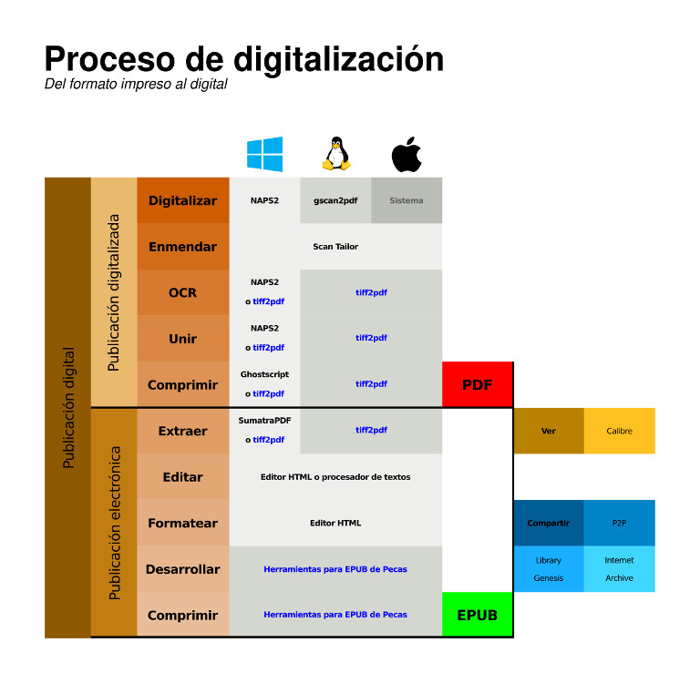

# *Scripts* para la digitalización de documentos

Aquí están presentes una serie de *scripts* pensados para agilizar o
automatizar la digitalización de documentos para obtener desde un PDF
hasta un EPUB. Estos son:

1. `tiff2pdf.rb`. Utiliza el poder de libtiff y de tesseract para crear 
   archivos PDF con OCR o TXT a partir de imágenes TIFF.
