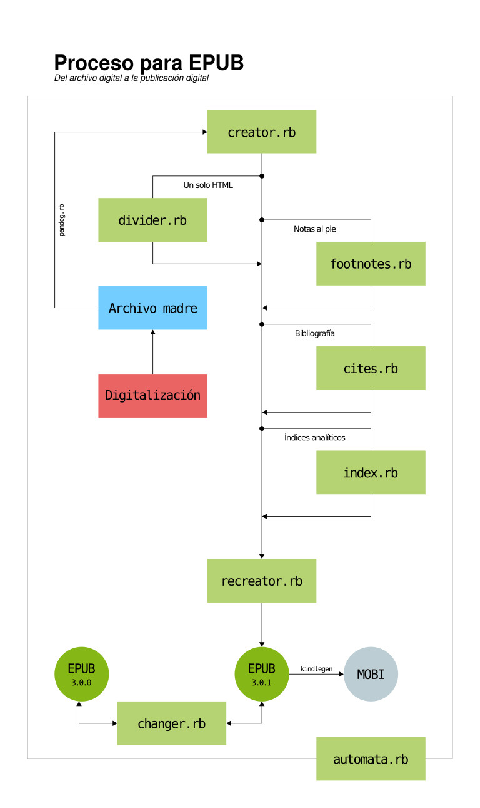

# *Scripts* para el desarrollo de EPUB

## EPUB con diseño fluido o fijo

Aquí están presentes una serie de *scripts*
pensados para agilizar o automatizar el desarrollo
de libros EPUB. Estos son:

1. `creator.rb`. Crea un proyecto para EPUB con 
distintas opciones.

2. `divider.rb`. Separa un documento HTML cada `<h1>`.

3. `notes.rb`. Agrega de manera automatizada
las notas a archivos con sintaxis tipo HTML o 
documentos TeX.

4. `cites.rb`. Agrega de manera automatizada la
bibliografía en formato `.bib`
([BibTeX](http://www.bibtex.org/)) a un EPUB.

5. `recreator.rb`. Recrea los archivos OPF, NCX y
NAV así como crea o recrea el archivo EPUB.

6. `changer.rb`. Cambia versiones de EPUB entre
`3.0.0` y `3.0.1`.

7. `index.rb`. Agrega índices analíticos para un
EPUB.

## Automatización

* `automata.rb`. Automatiza el flujo de trabajo al poder
usar todos los *scripts* para EPUB con una sola línea de comandos.

## YAML

Para la creación de metadatos, se utiliza un archivo con extensión `.yaml`.
Si se desconoce cómo usar el archivo, [consúltese el apartado de YAML](https://github.com/NikaZhenya/pecas/tree/master/epub/others/yaml).

## *Scripts* de JavaScript para EPUB

Estos *scripts* implementan algunas funcionalidades
adicionales a los EPUB, se encuentran en la carpeta
[`JavaScript`](https://github.com/NikaZhenya/pecas/tree/master/epub/others/javascript).

## EpubCheck

[EpubCheck](https://github.com/IDPF/epubcheck) es la herramienta de 
validación de EPUB de [IDPF](http://idpf.org/).

Esta carpeta contiene las versiones 3.0.1 y 4.0.2 de EpubCheck que 
pueden descargar desde su repositorio. La ventaja de esta carpeta es
que existe un binario para poder utilizar epubcheck de manera más 
sencilla.
